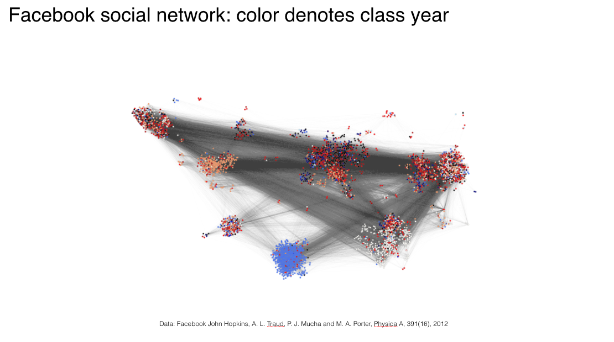
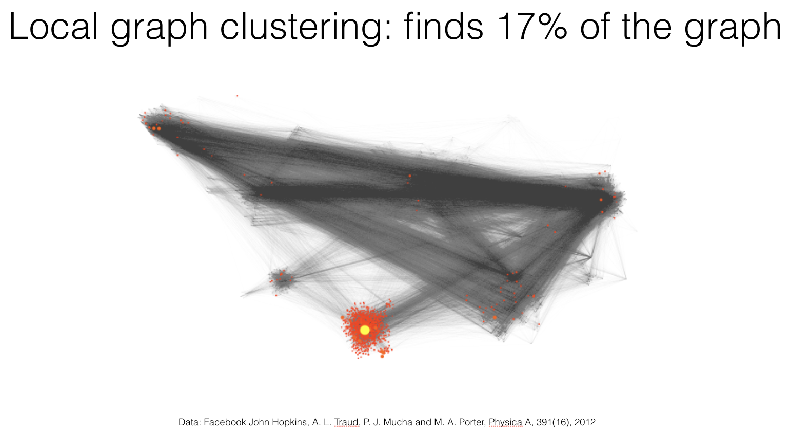
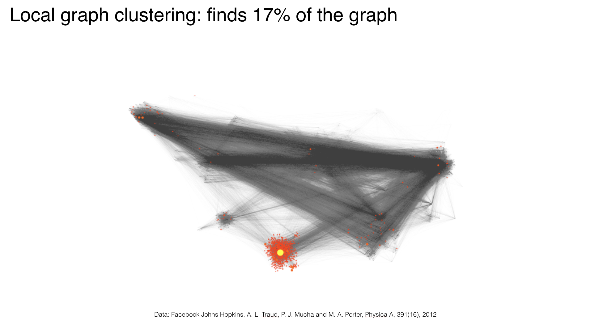
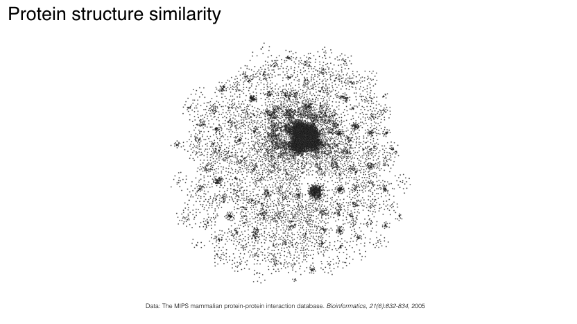
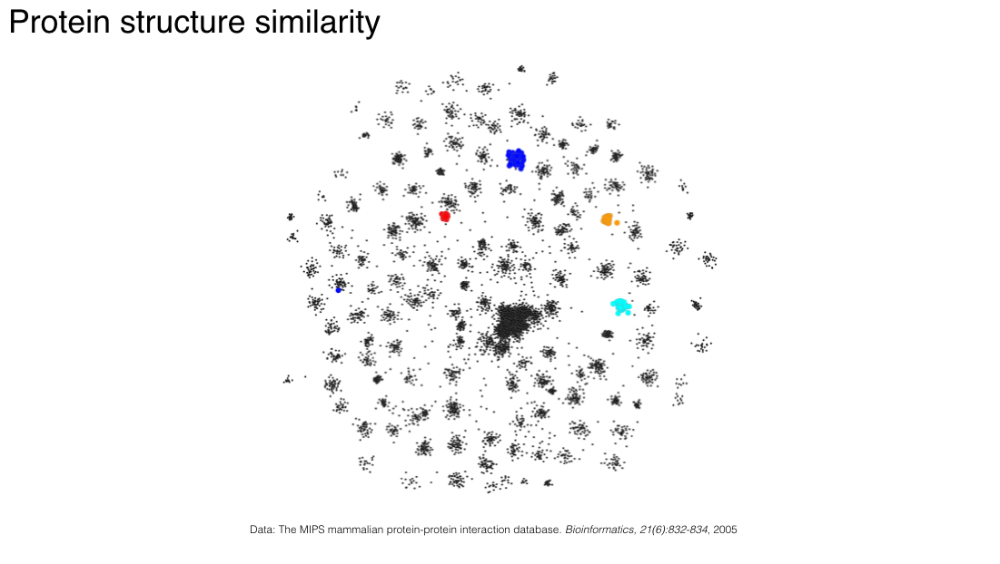
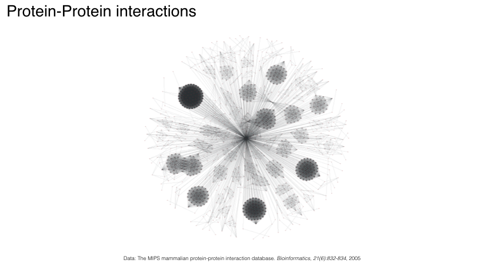
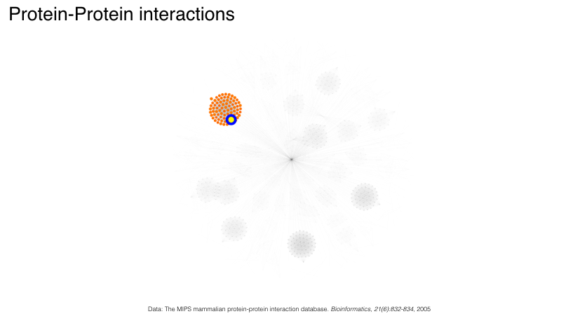
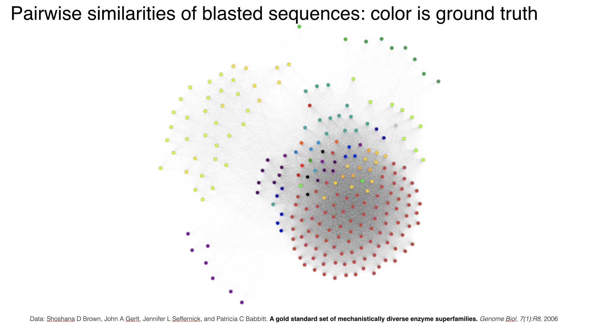
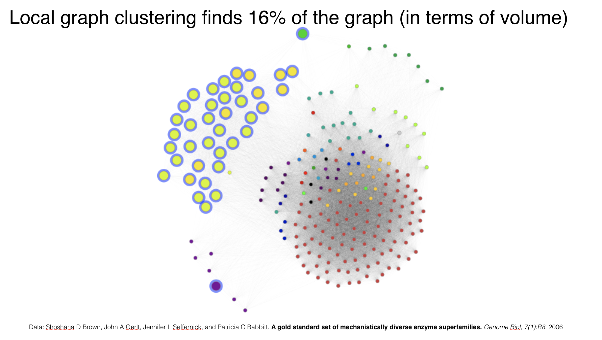

[](https://travis-ci.org/kfoynt/LocalGraphClustering)
[](https://coveralls.io/github/kfoynt/LocalGraphClustering?branch=master)
# Local Graph Clustering

Local Graph Clustering provides

- methods that find local clusters in a given graph without touching the whole graph
- methods that improve a given cluster
- methods for global graph partitioning
- tools to compute [Network Community Profiles](http://www.tandfonline.com/doi/abs/10.1080/15427951.2009.10129177)
- scalable graph analytics on your laptop

The current version is 0.5.0 and it is appropriate for experts and intermediates. Contact information for any questions and feedback is given below.

### Authors

- [Kimon Fountoulakis](http://www1.icsi.berkeley.edu/~kfount/), email: kimon.fountoulakis at uwaterloo dot ca
- [Meng Liu](https://www.cs.purdue.edu/homes/liu1740/), email: liu1740 at purdue dot edu
- [David Gleich](https://www.cs.purdue.edu/homes/dgleich/), email: dgleich at purdue dot edu
- [Michael Mahoney](https://www.stat.berkeley.edu/~mmahoney/), email: mmahoney at stat dot berkeley dot edu

### Contributors

- [Chufeng Hu](https://www.linkedin.com/in/chufeng-hu-545022114/?originalSubdomain=ca), email: chufeng dot hu at uwaterloo dot ca
- [Yuying Li](https://cs.uwaterloo.ca/~yuying/), email: yuying at uwaterloo dot ca 
- [Ben Johnson](https://github.com/bkj), email: bkj dot 322 at gmail dot com

## List of applications and methods

- [Approximate PageRank](https://dl.acm.org/citation.cfm?id=1170528)
- [L1-regularized PageRank](https://link.springer.com/article/10.1007/s10107-017-1214-8) (solved using accelerated proximal gradient descent)
- [PageRank Nibble](https://dl.acm.org/citation.cfm?id=1170528)
- [Rounding methods for spectral embeddings](https://dl.acm.org/citation.cfm?id=1170528)
- [MQI](https://link.springer.com/chapter/10.1007/978-3-540-25960-2_25)
- [FlowImprove](https://dl.acm.org/citation.cfm?id=1347154)
- [SimpleLocal](https://dl.acm.org/citation.cfm?id=3045595)
- [Capacity Releasing Diffusion](http://proceedings.mlr.press/v70/wang17b.html)
- [Multiclass label prediction](https://dl.acm.org/citation.cfm?id=2783376)
- [Network Community Profiles](http://www.tandfonline.com/doi/abs/10.1080/15427951.2009.10129177)
- Global spectral partitioning
- Find k clusters using local graph clustering (uses local graph clustering to do graph partitioning, local to global graph clustering)
- Graph partitioning using local graph clustering
- Image segmentation using local graph clustering
- Densest subgraph
- [Triangle clusters and vertex neighborhood metrics](https://arxiv.org/pdf/1112.0031.pdf)
- Handy network drawing methods

## Pipelines

- [Network Community Profiles](https://github.com/kfoynt/LocalGraphClustering/blob/master/notebooks/NCPs.ipynb)
- [Multiclass label prediction](https://github.com/kfoynt/LocalGraphClustering/blob/master/notebooks/multiclasslabelprediction.ipynb)
- [Triangle clusters and vertex neighborhood metrics](https://github.com/kfoynt/LocalGraphClustering/blob/master/notebooks/TriangleClustersAndVertexNeighborhoodMetrics.ipynb)
- [Find k clusters (local to global graph clustering)](https://github.com/kfoynt/LocalGraphClustering/blob/master/notebooks/find_clusters_social_network.ipynb)
- [Image segmentation](https://github.com/kfoynt/LocalGraphClustering/blob/master/notebooks/image_segmentation_using_local_graph_clustering.ipynb)
- [Image segmentation](https://github.com/kfoynt/LocalGraphClustering/blob/master/notebooks/image_segmentation_using_local_graph_clustering_and_gPb.ipynb) using [gPb](https://www2.eecs.berkeley.edu/Research/Projects/CS/vision/grouping/papers/amfm_pami2010.pdf)
- [Find small clusters in image using conductance](https://github.com/kfoynt/LocalGraphClustering/blob/master/notebooks/find_very_small_clusters_in_images.ipynb)

## Examples

All examples are in the [notebooks](https://github.com/kfoynt/LocalGraphClustering/tree/master/notebooks) folder.

Below is a simple demonstration from [test.py](https://github.com/kfoynt/LocalGraphClustering/blob/master/notebooks/test.py) in [notebooks](https://github.com/kfoynt/LocalGraphClustering/tree/master/notebooks) on how to improve spectral partitioning using flow-based methods from local graph clustering.

```python
from localgraphclustering import *

import time
import numpy as np

# Read graph. This also supports gml and graphml format.
g = GraphLocal('./datasets/senate.edgelist','edgelist',' ')

# Call the global spectral partitioning algorithm.
eig2 = fiedler(g)

# Round the eigenvector
output_sc = sweep_cut(g,eig2)

# Extract the partition for g and store it.
eig2_rounded = output_sc[0]

# Conductance before improvement
print("Conductance before improvement:",g.compute_conductance(eig2_rounded))

# Start calling SimpleLocal
start = time.time()
output_SL_fast = SimpleLocal(g,eig2_rounded)
end = time.time()
print("running time:",str(end-start)+"s")

# Conductance after improvement
print("Conductance after improvement:",g.compute_conductance(output_SL_fast[0]))

output_SL = output_SL_fast[0]
```

## Examples with visualization

For general examples with visualization using our built-in drawing methods, see the Jupyter notebook [examples with visualization](https://github.com/kfoynt/LocalGraphClustering/blob/master/notebooks/new_visualization_examples.ipynb).

For comparisons of spectral- and flow-based methods with visualization see the Jupyter notebooks [here](https://github.com/kfoynt/LocalGraphClustering/blob/master/notebooks/spectral_vs_flow_with_visualization.ipynb) and [here](https://github.com/kfoynt/LocalGraphClustering/blob/master/notebooks/spectral_vs_flow_2_with_visualization.ipynb).

For visual demonstration of algorithms that can improve a given seed set of nodes see the Jupyter notebook [here](https://github.com/kfoynt/LocalGraphClustering/blob/master/notebooks/improveType_algorithms_with_visualization.ipynb).

## Scalable graph analytics on your laptop

For examples using reasonably large graphs (100 million edges) on a 16GB RAM laptop please see the Jupyter notebook [here](https://github.com/kfoynt/LocalGraphClustering/blob/master/notebooks/examples_scalable_graph_analytics.ipynb).

## Advanced examples

For advanced examples see the Jupyter notebook [here](https://github.com/kfoynt/LocalGraphClustering/blob/master/notebooks/examples.ipynb).


## Demonstration: social networks

 
 

## Demonstration: bioinformatics networks

 
 
 

## Presentation

[](https://youtu.be/mf9h1-jhyos)

## When local graph clustering methods do not perform well?

In theory and in practice we have observed that the performance of local graph clustering methods
depends on the magnitute of the conductance of the target cluster as well as the magnitute of the minimum conductance
in the induced subgraph of the target cluster. Simply put, if the "internal connectivity" of the target cluster (the minimum conductance
in the induced subgraph of the target cluster) is not stronger than the "external connectivity" (the conductance of the target cluster) then local graph clustering methods have poor performance in terms of finding the target cluster. For theoretical details please see Section 3 in the [Capacity Releasing Diffusion for Speed and Locality](http://proceedings.mlr.press/v70/wang17b.html) paper. For extensive numerical experiments that demonstrate properties of challenging target clusters please see Section 4 in [Capacity Releasing Diffusion for Speed and Locality](http://proceedings.mlr.press/v70/wang17b.html) as well as the supplementary material in the same link.


## Installation

```
Clone the repo
```
```
Enter the folder using the termimal
```
```
Type in the terminal `python setup.py install`
```
Note that this package runs only with Python 3.

It can also be installed through pip:

```
pip3 install localgraphclustering
```

## Import from Julia

1. In Julia, add the PyCall package: 
   
   `Pkg.add("PyCall")`
2. Update which version of Python that PyCall defaults to:

    `ENV["PYTHON"] = (path to python3 executable) `

    `Pkg.build("PyCall")`

    (You can get the path to the python3 executable by just running "which python3" in the terminal.)
3. Make sure the PyPlot package is added in Julia.

4. Import *localgraphclustering* by using:

   `using PyPlot`
   
   `using PyCall`

   `@pyimport localgraphclustering`

You can now use any routine in *localgraphluserting* from Julia.

## License

LocalGraphClustering,
Copyright (C) 2017, Kimon Fountoulakis, Meng Liu, David Gleich, Michael Mahoney

This program is free software: you can redistribute it and/or modify
it under the terms of the GNU General Public License as published by
the Free Software Foundation, either version 3 of the License, or
(at your option) any later version.
